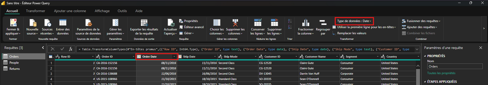
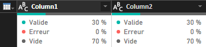
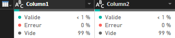
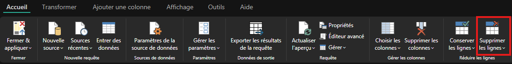
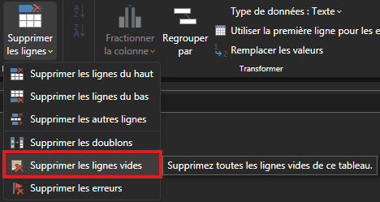
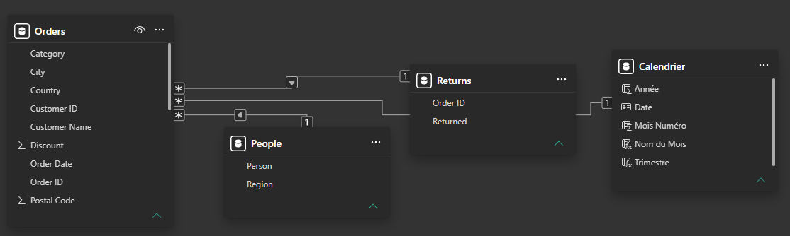
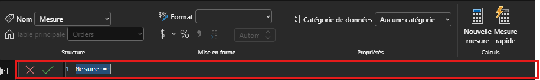

# Analyse 1 — Superstore

> Fichier source : [Kaggle](https://www.kaggle.com/datasets/yesshivam007/superstore-dataset)

---

## Brief
**Contexte fictif:** *Ayant rejoint l'équipe data d'une chaine de magasins américaine, la direction commerciale veut un tableau de bord pour piloter les ventes et la rentabilité.*

**Les colonnes à observer sont:**
- `Order Date`, `Ship Date` -> dimensions temporelle
- `Region`, `State`, `City` -> dimension géographique
- `Category`, `Sub-Category`, `Product Name` -> dimension produit
- `Customer Name`, `Segment` -> dimension client
- `Sales`, `Quantity`, `Discount`, `Profit` -> mesures financières

## Étapes de travail

### Phase 1 — Préparation des données (Power Query)
- Vérifier les types de données (dates, nombres, texte)
- Vérifier les doublons/valeurs manquantes
- Créer une table Calendrier (**indispensable** pour les fonctions de Time Intelligence en DAX)

### Phase 2 — Modélisation 
- Organiser en modèle en étoile si possible (table de faits `Orders` + dimensions)
- Créer les relations entre tables

### Phase 3 — Mesures DAX à créer
- `Total Sales`, `Total Profit`, `Profit Margin %`
- `Sales YTD`, `Sales vs Previous Year`
- `Top Sub-Category by Profit`

### Phase 4 — Construction du dashboard (2-3 pages)
- Page 1 - Vue d'ensemble : KPIs (ventes, profit, marge, nb commandes), courbe d'évolution, carte géographique 
- Page 2 - Analyse produit : ventes/profit par catégorie et sous-catégorie, top/flop produits
- Page 3 - Analyse client : segments, top clients, remises vs profit (attention, c'est un point clé du dataset — la relation discount/profit révèle souvent des pertes cachées)

---

## Application des phases

Avant toute choses, il faut sélectionner le fichier en question.
Pour cela, on sélectionne (dans notre cas) *"Importer des données à partir d'Excel"* puisque notre fichier est sous la forme d'un tableau avec l'extension `.xlsx`.

Ensuite on nous propose plusieurs tableaux différents:
- `Order`
- `People`
- `Return`

Ceux-ci correspondent aux différentes tables que l'on a dans le fichier.

**Maintenant, que choisir ?** Les trois ! Chacunes ont une utilité spécifique qui pourrons, plus tard, être lié (d'où le modèle en étoile)

On sélectionne donc les trois tables et on fait "Transformer les données" afin de vérifier/nettoyer les tables dans Power Query. 

### Phase 1 — Préparation des données (Power Query)

Initialement on vérifie si les données sont bien sous le bon format. Pour cela, on à deux façon de regarder: 
- Sélectionner la colonne et regarder *"Type de données : {DONNEE}"* dans la section *Transformer*

 

- On regarde le code DAX (ou M, language de Power Querry) pour regarder les types
```M
= Table.TransformColumnTypes(#"En-têtes promus",{{"Row ID", Int64.Type}, {"Order ID", type text}, {"Order Date", type date}, {"Ship Date", type date}, [...] ,{"Profit", type number}}) 
```

Pour la modifier il suffit juste de cliquer sur `Type de données` mentionnée précédemment ou bien directement sur l'icone de type sur la colonne (Pour texte ce sera un logo *ABC*, pour un entier ce sera *123* etc.) et de choisir celle voulu.  

> ⚠️ Pour nous, `Sales` est définit en Nombre décimal, or il nous le faut en Nombre décimal **fixe**  

Ensuite, il faut s'assurer que les En-têtes de colonnes soient bonnes. Pour `Orders` c'est le cas mais pas pour les deux autres qui sont `Return` et `People`. On remarque que les en-têtes sont `Column1` et `Column2`, il faut donc les modifier. Pour cela, il suffit de cliquer sur *Utiliser la première ligne pour les en-têtes* dans la catégorie *Tableau* 

Maintenant que l'on a définit nos types et modifié nos en-têtes, il faut faire attentions à ce que il n'y est pas de cellules vides ni de doublons. Faisont ses traitements dans l'ordre:
- Pour les valeurs manquantes il existe un outil qui donne un aperçu rapide, colonne par colonne, du pourcentage de valeurs vides/erreurs/distincts. Pour cela on va devoir revenir sur Power Query (Onglet *Requête* -> *Transformer les données*) et aller dans l'onglet *Afficher* et cocher *Qualité de la colonne*, cela nous donnes les statistiques de chaque colonnes. Par chance dans notre cas tout est parfait pour la table Orders mais ce n'est pas le cas pour les deux autres Peopla et Returns.  

| Résultats table `Return` | Résultats table `People` |
| :-: | :-: |
|  |  |  

Il faut analyser ses cellules vides, déterminer pourquoi elles le sont et si il faut les corriger. Pour `Return` et `People` on remarque que les cellules vides sont sur les deux colonnes à la fois, donc des lignes vides. Cela pousse à dire que le formattage initial des tables se sont faites à partir de la plus grande, qui est ici `Orders` avec 1000 lignes. Faut-il donc les corriger ? **Oui**, ici les cellules vides ne servent à rien et ne risque pas d'embêter les futures relations.
Pour les corriger, il suffit de sélectionner une table (pas besoin de faire CTRL+A ensuite) cliquer sur *Supprimer les lignes* et sélectionner *Supprimer les lignes vides*. Aussi simple que ça !




---
#### Création de la nouvelle table Calendrier

La prochaine étape est de créer une table `Calendrier`. Cette table sera à part et couvrira toute les périodes du dataset (par exemple du 01/01/2014 au 31/12/2017, même si les dates ne sont pas toutes présentes dans Orders, il ne doit pas y avoir de "trou").  

Cela donne typiquement:  
| Colonne |	Exemple |
|-|-|
| Date               | 15/03/2016                                         |
| Année              | 2016                                               |
| Trimestre          | T1                                                 |
| Mois (numéro)      | 3                                                  |
| Nom du mois        | Mars                                               |
| Jour de la semaine | Mardi                                              |
| Semaine            | 11                                                 |
| Année-Mois         | 2016-03 (utile pour trier les axes chronologiques) |

**Pourquoi ne pas simplement utiliser `Order Date` de la table `Order` ?** On peut être très vite bloqué:
- On ne peux pas croiser facilement `Order Date` et `Ship Date` sur la même timeline
- Les fonctions DAX de Time Intelligence (`TOTALYTD`, `SAMEPERIODLASTYEAR`, `DATEADD`...) **fonctionnent mal ou pas du tout sur une colonne de date "brute"** issue d'une table de faits (surtout si des dates sont dupliquées ou manquantes)
- On ne peux pas ajouter facilement des colonnes utiles comme "Trimestre", "Nom du mois", "Jour de la semaine", "Semaine ISO"...

Tout d'abord, on peut fermer Power Query en haut à droite en faisant "Fermer & appliquer".  
Ensuite, dans la colonne de droite on clique sur *"Afficher Table"* et enfin dans le menu du haut *"Nouvelle Table"*.

On se retrouve alors avec rien, logique jusqu'à.
On va tout d'abord trier toute les dates dans l'ordre croissant, pour ça on se retrouve dans la zone de texte pour y écrire notre formule en DAX.  

**Qu'est ce que DAX ?**  *"DAX (Data Analysis Expressions) est une collection de fonctions, d’opérateurs et de constantes qui peuvent être utilisées dans une formule ou une expression, pour calculer et retourner une ou plusieurs valeurs. DAX vous permet de créer des informations à partir des données qui se trouvent déjà dans votre modèle."*  

*Source: [learn.microsoft.com](https://learn.microsoft.com/fr-fr/power-bi/transform-model/desktop-quickstart-learn-dax-basics)*

Le language est très similaire à celui d'Excel, avec:
- Le nom de la mesure
- Le signe égal (=), indiquant le début de la formule
- Une fonction spécifique (par exemple SUM)
- Des parenthèses qui entourent une expression qui contient un ou plusieurs arguments

Par exemple:
```M
Total Sales = SUM(Sales[SalesAmount])
```
correspond à la mesure `Total Sales`, correspondant à la formule calculant la somme de tout les éléments de la Table[Colonne] `Sales[SalesAmount]`

La formule à retenir est `CALENDAR` qui retourne une table à une colonne de toutes les dates comprises entre `StartDate` et `EndDate`. Maintenant il faut définir nos `StartDate` et `EndDate`, pour ça rien de plus simple on précise la date minimum/maximum de notre colonne `Order Date` dans la table `Orders`.  
Ce qui nous donne le code suivant :
```M
Calendrier = CALENDAR(MIN(Orders[Order Date]), MAX(Orders[Order Date]))
```

Maintenant que l'on a extrait toutes les dates de notre dataset dans l'ordre croissant on peut y définir d'autre informations:
```M
Année = YEAR(Calendrier[Date])
Mois Numéro = MONTH(Calendrier[Date])
Nom du Mois = FORMAT(Calendrier[Date], "MMMM")
Trimestre = "T" & QUARTER(Calendrier[Date])
```

Maintenant que l'on a fait tout ça, il faut définir notre table en **"Table des dates"**.
Pour ça, il suffit juste de cliquer sur *"Marquer comme table de dates"*, cocher *"Marque en tant que table de dates"* et sélectionner la colonne Date.

---

### Phase 2 — Modélisation 
Nous avons maintenant 4 tables: `Order`, `People`, `Returns` et `Calendrier`.
Avant de rentrer dans le vif, il faut nous assurer d'une chose: savoir la **table des faits** (celle avec les mesures Sales, Profit, Quantity...) et lesquelles sont les **tables de dimenssions** (celles qui servent à filtrer/catégoriser).
Cela nous permettra par la suite de n'utiliser que les tables de dimensions pour faire nos visuelles, jamais directement la table des faits.

Dans notre cas le choix est simple, on remarque que **Orders est la table des faits** car elle contient toutes les mesures et **les autres sont celle de dimenssions** car elle servent à filtrer et catégoriser.

Maintenant que l'on a décidé les type de table, il faut choisir des relations entre ses tables, **les tables de dimension pointe vers la table des faits** (relation 1:*). Pour ça, il faut trouver les liaisons entre les tables. 
Cela peut se faire naturellement:
- La colonne Date pour Calendrier et Orders
- la colonne Order ID pour Returns et Orders

Mais pour People il faut un peut creuser... En effet à première vue on pourrait se dire que le choix serait de prendre People[Person] et Orders[Customer Name] mais attention, la table People correspond aux nom des producteurs et non des clients. De plus, si on prend le premier nom "Anna Andreadi", on remarque qu'il n'existe pas dans la colonne Customer Name de Orders. Donc il faut prendre la colonne People[Region] et Orders[Region].

<div align=center>
    
    
    
</div>  

Pour conclure, voici notre modèle en étoile:
| Dimension         | Table de faits        | Colonnes	| Cardinalité |  
|-|-|-|-|
| Calendrier[Date]	| Orders[Order Date]	| Date	    | 1:* |
| People[Region]	| Orders[Region]	    | Région	| 1:* |
| Returns[Order ID]	| Orders[Order ID]	    | Order ID	| 1:* |

Et un rendu visuelle dans l'onglet *Vue de modèle*


---

### Phase 3 — Mesures DAX à créer

Maintenant on va devoir créer nos propres mesures, celles-ci nous permettrons par la suite de donner des informations suplémentaires dans notre tableau de bord.  
**Tout d'abord, où écrire nos mesures ?** Pour cela, il suffit de cliquer sur *Nouvelle mesure* dans la zone *Calculs* et d'ensuite rentrer notre formule dans la zone situé au dessus de la table.  




Rappelons nous les mesures à faire :
- `Total Sales`, `Total Profit`, `Profit Margin %`
- `Sales YTD`, `Sales vs Previous Year`
- `Top Sub-Category by Profit`

Les trois premières sont assez simple et assez directe, juste des simple sommes et une division
```dax
Total Sales = SUM(Orders[Sales])
Total Profit = SUM(Orders[Profit])
Profit Margin % = DIVIDE([Total Profit], [Total Sales]) * 100
```

Pour les suivante, il faut un tout petit peu réfléchir et décomposer le problème.  
**Sales YTD**: Tout d'abord qu'est ce que le YTD ? Year To Date se traduit en *année en cours* ou *depuit le début de l'année* et veut simplement signifier le profit (ou autre montant) depuis le début de l'année jusqu'au mois courant. Par exemple si nous somme en Septembre alors le YTD se fera du 1er janvier au **31** (et non 1er) septembre. 

Dans notre cas, on peut s'aider de `Total Sales` en lui appliquant un filtre pour n'exécuter la formule que sur une plage spécifique. Par chance il existe déjà une formule qui nous fait tout: `TOTALYTD`, celle-ci évalue une expressions spécifié (dans notre cas `SUM(Orders[Sales]))`) sur l'intervalle qui commence le premier jour de l'année et se termine à la dernière date dans la colonne de date spécifié. Ce qui nous donne la fonctione suivante:
```dax
Sales YTD = TOTALYTD(SUM(Orders[Sales]), Calendrier[Date])
```
Si on aurait voulu remplacer `TOTALYTD`, il aurait fallu plusieurs étapes supplémentaires. Tout d'abord il aurait fallu filter les dates, allant du 1er janvier à la date courante (**qui est considéré comme la date maximale**) et ensuite il aurait fallu calculer `Total Sales` sur ce filtre. Ce qui donne ceci:  
```dax
Sales YTD = 
    CALCULATE(
        [Total Sales], 
        FILTER(
            Calendrier,
            Calendrier[Date] <= MAX(Calendrier[Date]) && Calendrier[Année] = YEAR(MAX(Calendrier[Date]))
        ))
```